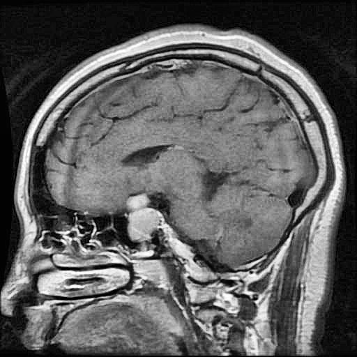
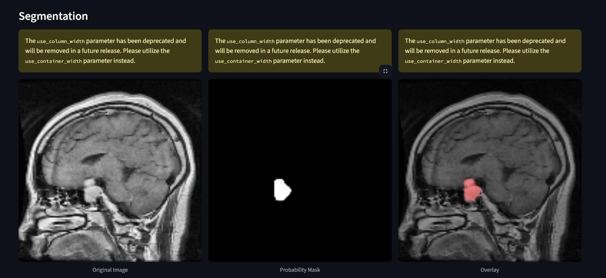

# Brain Tumor Detection, Classification & Segmentation

A complete deep-learning pipeline for analyzing brain MRI images —
binary tumor detection, tumor-type classification (Meningioma, Glioma, Pituitary), and pixel-wise semantic segmentation using a custom UNet. Includes a Streamlit app so anyone can try the model from the browser.

---

##  Quick start

```bash
pip install -r requirements.txt
cd streamlit_app
streamlit run app.py
```

Open your browser at the address Streamlit prints (usually [http://localhost:8501](http://localhost:8501)).

---

## ✅ Features

* **Binary Tumor Classification** — Tumor vs No Tumor.
* **Tumor Type Identification** — Meningioma, Glioma, Pituitary.
* **Semantic Segmentation** — Custom-built U-Net architecture that outputs tumor masks.
* **Streamlit App** — Upload an MRI and get predictions + segmentation in the browser.
* Clean, modular project structure so you can re-train, evaluate, or extend easily.

---

## 📁 Repository structure

```
├─ streamlit_app/        # Streamlit web app (app.py)
├─ src/                  # Model code: UNet, classifiers, training + utils
├─ results/                 
├─ sample_images/       # Sample MRI images you can try out
├─ requirements.txt
└─ README.md
```

> The `src/` folder contains the neural network code you built for:
>
> * custom **UNet** segmentation model, and
> * tumor classifiers (binary + 3-class tumor type classifier).

---

## 🧩 Model details

* **Segmentation network:** Custom U‑Net (encoder–decoder with skip connections). Implemented in **TensorFlow / Keras**.
* **Classification networks:** Lightweight CNN heads trained for binary tumor detection and 3-way tumor type classification.
* **Training dataset:** Models were trained on a Kaggle dataset (link below). Training was performed on Kaggle (or your preferred GPU environment).

**Kaggle dataset:**
`<(https://www.kaggle.com/datasets/indk214/brain-tumor-dataset-segmentation-and-classification)>`


---


## 🖼️ Demo images

- **Input example** — *what the user will upload*:



- **Predicted output** — *segmentation mask overlay + predicted tumor category*:



---

## 🧪 How to use

1. Run the Streamlit app (see Quick start).
2. In the web UI, click **Browse files** and select an MRI (or try a sample from `sample/`).
3. Click **Predict**. The app will display:

   * Tumor present? (Yes / No)
   * If present: tumor type (Meningioma / Glioma / Pituitary)
   * Segmentation mask overlaid on the original MRI


---

## 🧾 Notes / Tips

* I used **TensorFlow** and trained the models on **Kaggle** (GPU runtime). 
* If you plan to publish the model, include model cards and details about the dataset splits (train/val/test), performance metrics (Dice, IoU, accuracy), and known limitations.

---

---

##  Author

Praveen V.V.J — 2025

---

